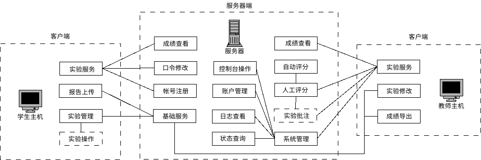

# Linux实验系统介绍

“Linux课程实验教学系统”（以下简称”Linux实验系统“，英文名称为linuxer）源自西南科技大学实验技术研究项目“面向MOOC的Linux课程实验教学技术研究”（项目编号：15syjs-22），是“Linux系统安全管理及开发（课程编号：JK160070）”课程组开发的一个交互式实验系统。

Linux实验系统采用Shell脚本语言，基于Linux系统管理技术，通过对Linux环境下的文件系统、认证系统、访问控制、日志系统、FTP服务、SSH远程管理服务等基础功能的综合应用，实现了一个满足“Linux系统安全管理及开发”课程实验要求、融入课程内容、易于开发的应用系统。

Linux实验系统采用C/S模式（“客户/服务器”模式），其中，客户端包括两个程序，学生客户端具有报告上传、实验管理、实验操作等功能，教师客户端具有实验修改、成绩导出等功能；服务器端包括提供给学生的成绩查看、口令修改、帐号注册等功能，以及提供给教师的包括成绩查看、自动评分、人工评分、实验批注、系统管理等功能；此外，服务器端需要使用一些基础服务，如FTP服务、SSH服务、Git服务等。


<center>图1 Linux实验系统架构</center>

# Linux实验系统安装

Linux实验系统可以安装在一台计算机上，同时实现客户和服务器端功能，作为独立的实验环境，安装步骤详见`doc/INSTALL`；也可以将服务器端部分安装在远程计算机上，作为远程教学使用。

Linux实验系统安装在Ubuntu 64位版本中，目前测试通过的版本包括：

- Bionic 18.04 (LTS)
- Eoan 19.10 (LTS)

# Linux实验系统使用

安装完成后，Linux实验系统位于`/opt/linuxer`目录中（实验系统目录），因此，启动客户端程序可使用命令：

```bash
/opt/linuxer/bin/linuxer.bash
```

或者Linux实验系统源代码目录中使用命令：

```bash
make
```